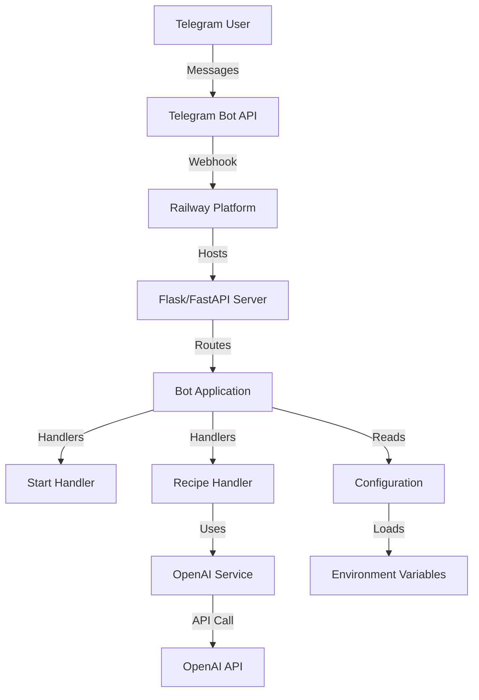
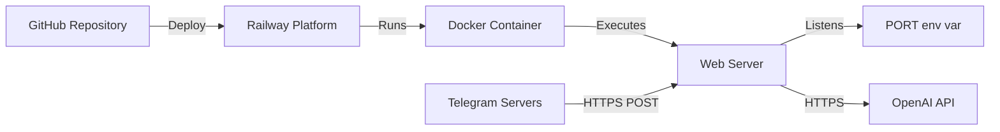

# Design Document: Telegram Recipe Bot

## Overview

Telegram Recipe Bot - это кулинарный помощник, который помогает пользователям находить рецепты на основе доступных продуктов. Бот принимает текстовый список ингредиентов и использует OpenAI API для генерации персонализированных рецептов с пошаговыми инструкциями.

Система развёрнута на платформе Railway и использует webhook-механизм для получения обновлений от Telegram. Архитектура построена на принципах разделения ответственности: обработчики команд, сервисный слой для внешних API, и конфигурационный модуль.

Основные возможности:
- Приветственное сообщение с инструкциями по команде /start
- Приём списка продуктов в свободной текстовой форме
- Генерация рецептов через OpenAI ChatGPT
- Форматированный вывод рецептов с эмодзи
- Обработка ошибок с понятными сообщениями пользователю
- Безопасное хранение API ключей через переменные окружения

## Architecture

### High-Level Architecture



### Component Architecture

Система состоит из следующих слоёв:

1. **Transport Layer (Webhook Server)**
   - Flask/FastAPI веб-сервер для приёма webhook запросов от Telegram
   - Обработка входящих HTTP POST запросов
   - Передача обновлений в Bot Application

2. **Application Layer (Bot Core)**
   - Инициализация Telegram Bot
   - Регистрация обработчиков команд и сообщений
   - Маршрутизация входящих обновлений к соответствующим handlers

3. **Handler Layer**
   - StartHandler: обработка команды /start
   - RecipeHandler: обработка текстовых сообщений с продуктами
   - Валидация входных данных
   - Форматирование ответов

4. **Service Layer**
   - OpenAIService: взаимодействие с OpenAI API
   - Формирование промптов
   - Обработка ответов от API
   - Обработка ошибок API

5. **Configuration Layer**
   - Загрузка переменных окружения
   - Валидация обязательных параметров
   - Предоставление конфигурации другим компонентам

### Deployment Architecture



Railway автоматически:
- Обнаруживает Python проект
- Устанавливает зависимости из requirements.txt
- Использует runtime.txt для выбора версии Python
- Запускает команду из Procfile
- Предоставляет переменную окружения PORT
- Настраивает HTTPS endpoint для webhook

## Components and Interfaces

### 1. bot.py (Main Entry Point)

**Responsibility:** Инициализация и запуск бота

**Interface:**
```python
def main() -> None:
    """Initialize and start the bot with webhook"""
    
def setup_webhook(app: Application, flask_app: Flask) -> None:
    """Configure webhook endpoint"""
```

**Dependencies:**
- config.py для получения токенов
- handlers для регистрации обработчиков
- Flask/FastAPI для webhook сервера

**Behavior:**
- Загружает конфигурацию
- Создаёт Application объект python-telegram-bot
- Регистрирует все handlers
- Настраивает webhook endpoint
- Запускает веб-сервер на порту из переменной окружения PORT

### 2. config.py (Configuration Module)

**Responsibility:** Управление конфигурацией и переменными окружения

**Interface:**
```python
class Config:
    TELEGRAM_TOKEN: str
    OPENAI_API_KEY: str
    WEBHOOK_URL: str
    PORT: int
    
    @classmethod
    def validate() -> None:
        """Validate required environment variables exist"""
```

**Dependencies:**
- os для доступа к переменным окружения
- python-dotenv для загрузки .env файла

**Behavior:**
- Загружает .env файл в development режиме
- Читает обязательные переменные: TELEGRAM_TOKEN, OPENAI_API_KEY
- Читает опциональные переменные: WEBHOOK_URL, PORT (default 8080)
- Выбрасывает исключение при отсутствии обязательных переменных
- Предоставляет централизованный доступ к конфигурации

### 3. handlers/start_handler.py

**Responsibility:** Обработка команды /start

**Interface:**
```python
async def start_command(update: Update, context: ContextTypes.DEFAULT_TYPE) -> None:
    """Handle /start command"""
```

**Dependencies:**
- telegram.Update
- telegram.ext.ContextTypes

**Behavior:**
- Принимает Update объект с командой /start
- Формирует приветственное сообщение на русском языке
- Включает инструкции по использованию бота
- Отправляет сообщение пользователю через context.bot.send_message

**Message Format:**
```
Привет! 👋

Я помогу тебе придумать, что приготовить из продуктов в твоём холодильнике.

Просто отправь мне список продуктов, и я предложу рецепт!

Например: "курица, рис, морковь, лук"
```

### 4. handlers/recipe_handler.py

**Responsibility:** Обработка текстовых сообщений с продуктами

**Interface:**
```python
async def recipe_message(update: Update, context: ContextTypes.DEFAULT_TYPE) -> None:
    """Handle text messages with ingredients"""
```

**Dependencies:**
- telegram.Update
- telegram.ext.ContextTypes
- services.openai_service.OpenAIService

**Behavior:**
- Принимает текстовое сообщение от пользователя
- Валидирует, что сообщение не пустое
- Если пустое - отправляет "Пожалуйста отправь список продуктов."
- Вызывает OpenAIService для генерации рецепта
- Форматирует ответ с эмодзи и структурой
- Обрабатывает ошибки от OpenAI Service
- Отправляет форматированный рецепт или сообщение об ошибке

### 5. services/openai_service.py

**Responsibility:** Взаимодействие с OpenAI API

**Interface:**
```python
class OpenAIService:
    def __init__(self, api_key: str):
        """Initialize OpenAI client"""
    
    async def generate_recipe(self, ingredients: str) -> str:
        """Generate recipe from ingredients list"""
```

**Dependencies:**
- openai library
- config.py для API ключа

**Behavior:**
- Инициализирует OpenAI клиент с API ключом
- Формирует system prompt для кулинарного помощника
- Отправляет запрос к ChatGPT с ingredients как user message
- Использует модель gpt-3.5-turbo или gpt-4
- Парсит ответ и возвращает текст рецепта
- Выбрасывает исключение при ошибках API
- Логирует ошибки для отладки

**System Prompt:**
```
Ты кулинарный помощник. Пользователь отправляет список продуктов. 
Нужно предложить блюдо, которое можно приготовить из этих продуктов. 
Ответ должен содержать:
1. Название блюда
2. Список ингредиентов
3. Пошаговый рецепт
4. Время приготовления

Если ингредиентов мало — предложи простое блюдо. 
Не добавляй экзотические ингредиенты.
```

### 6. Web Server (Flask/FastAPI)

**Responsibility:** Приём webhook запросов от Telegram

**Interface:**
```python
@app.post("/webhook")
async def webhook_handler(request: Request) -> dict:
    """Handle incoming webhook from Telegram"""
```

**Dependencies:**
- Flask или FastAPI framework
- telegram.ext.Application

**Behavior:**
- Слушает POST запросы на /webhook endpoint
- Парсит JSON body с Update объектом
- Передаёт Update в telegram Application для обработки
- Возвращает HTTP 200 OK
- Обрабатывает ошибки парсинга

## Data Models

### Telegram Update Object

Входящие данные от Telegram API:

```python
{
    "update_id": int,
    "message": {
        "message_id": int,
        "from": {
            "id": int,
            "first_name": str,
            "username": str
        },
        "chat": {
            "id": int,
            "type": str
        },
        "text": str,
        "date": int
    }
}
```

### OpenAI Request Format

```python
{
    "model": "gpt-3.5-turbo",
    "messages": [
        {
            "role": "system",
            "content": str  # System prompt
        },
        {
            "role": "user",
            "content": str  # Ingredient list
        }
    ],
    "temperature": 0.7,
    "max_tokens": 1000
}
```

### OpenAI Response Format

```python
{
    "id": str,
    "object": "chat.completion",
    "created": int,
    "model": str,
    "choices": [
        {
            "index": 0,
            "message": {
                "role": "assistant",
                "content": str  # Generated recipe
            },
            "finish_reason": "stop"
        }
    ],
    "usage": {
        "prompt_tokens": int,
        "completion_tokens": int,
        "total_tokens": int
    }
}
```

### Recipe Response Format

Форматированный ответ пользователю:

```
🍽 Блюдо: [Название блюда]

Ингредиенты:
- [Ингредиент 1]
- [Ингредиент 2]
...

Рецепт:
1. [Шаг 1]
2. [Шаг 2]
...

⏱ Время приготовления: [X минут]
```

### Configuration Data

```python
{
    "TELEGRAM_TOKEN": str,      # Required
    "OPENAI_API_KEY": str,      # Required
    "WEBHOOK_URL": str,         # Required for Railway
    "PORT": int                 # Default: 8080
}
```

### Error Response Format

```python
{
    "error_message": "Произошла ошибка при генерации рецепта. Попробуйте ещё раз.",
    "error_type": str,          # For logging
    "timestamp": datetime
}
```


## Correctness Properties

*A property is a characteristic or behavior that should hold true across all valid executions of a system-essentially, a formal statement about what the system should do. Properties serve as the bridge between human-readable specifications and machine-verifiable correctness guarantees.*

### Property 1: Start command returns welcome message

*For any* user who sends the /start command, the bot should respond with a welcome message that includes usage instructions in Russian language.

**Validates: Requirements 1.1, 1.2, 1.3**

### Property 2: Non-empty text messages are processed

*For any* non-empty text message sent by a user, the bot should accept and process it as an ingredient list (not reject it).

**Validates: Requirements 2.1, 2.3**

### Property 3: Valid ingredients trigger OpenAI API request

*For any* valid (non-empty) ingredient list, the OpenAI service should send a request to the OpenAI API.

**Validates: Requirements 3.1**

### Property 4: API request contains required structure

*For any* API request sent to OpenAI, the request should include: (1) the specified system prompt about being a culinary assistant, (2) the user's ingredient list as the user message, and (3) a ChatGPT model specification.

**Validates: Requirements 3.2, 3.3, 3.4**

### Property 5: Recipe response contains all required sections

*For any* recipe generated by OpenAI, the formatted response should contain all required sections: dish name with "🍽 Блюдо:" prefix, "Ингредиенты:" section, "Рецепт:" section with numbered steps, and cooking time with "⏱ Время приготовления:" prefix.

**Validates: Requirements 4.1, 4.2, 4.3, 4.4**

### Property 6: Formatted recipe is sent to user

*For any* successfully generated recipe, the bot should send the formatted response to the user who requested it.

**Validates: Requirements 4.5**

### Property 7: Errors are logged

*For any* error that occurs during recipe generation, the bot should create a log entry with error details.

**Validates: Requirements 5.2**

### Property 8: Bot continues after errors

*For any* error during recipe generation, after responding with an error message, the bot should continue to accept and process subsequent requests from users.

**Validates: Requirements 5.3**

### Property 9: Configuration loaded from environment

*For any* bot initialization, the system should successfully read TELEGRAM_TOKEN and OPENAI_API_KEY from environment variables.

**Validates: Requirements 6.1, 6.2**

### Property 10: Webhook endpoint processes updates

*For any* valid Telegram update sent to the webhook endpoint, the bot should process it and route it to the appropriate handler.

**Validates: Requirements 7.2**

## Error Handling

### Error Categories

1. **User Input Errors**
   - Empty ingredient list
   - Invalid message format (handled gracefully)
   
2. **External API Errors**
   - OpenAI API timeout
   - OpenAI API rate limit exceeded
   - OpenAI API authentication failure
   - Network connectivity issues
   
3. **Configuration Errors**
   - Missing environment variables
   - Invalid API keys
   - Invalid webhook URL
   
4. **Runtime Errors**
   - Unexpected exceptions in handlers
   - Message parsing errors
   - Webhook processing errors

### Error Handling Strategy

**User Input Errors:**
- Validate input before processing
- Return friendly error messages in Russian
- Example: "Пожалуйста отправь список продуктов." for empty input
- Do not expose technical details to users

**External API Errors:**
- Catch all OpenAI API exceptions
- Log full error details (error type, message, timestamp, user_id)
- Return generic error message: "Произошла ошибка при генерации рецепта. Попробуйте ещё раз."
- Implement retry logic for transient failures (optional enhancement)
- Continue bot operation after error

**Configuration Errors:**
- Validate all required environment variables at startup
- Fail fast with descriptive error message
- Example: "Missing required environment variable: TELEGRAM_TOKEN"
- Prevent bot from starting with invalid configuration

**Runtime Errors:**
- Wrap all handler functions in try-except blocks
- Log unexpected exceptions with full stack trace
- Send generic error message to user
- Continue processing other requests
- Monitor error rates for alerting

### Logging Strategy

**Log Levels:**
- INFO: Bot startup, webhook setup, successful recipe generation
- WARNING: Retryable API errors, rate limiting
- ERROR: API failures, unexpected exceptions
- DEBUG: Request/response details (development only)

**Log Format:**
```python
{
    "timestamp": "2024-01-15T10:30:00Z",
    "level": "ERROR",
    "component": "OpenAIService",
    "message": "Failed to generate recipe",
    "user_id": 123456789,
    "error_type": "APIError",
    "error_details": "Rate limit exceeded"
}
```

**What to Log:**
- All API calls (success and failure)
- User commands and message counts
- Error occurrences with context
- Configuration loading
- Webhook requests received

**What NOT to Log:**
- API keys or tokens
- Full message content (privacy)
- User personal information

## Testing Strategy

### Dual Testing Approach

The testing strategy combines two complementary approaches:

1. **Unit Tests**: Verify specific examples, edge cases, and error conditions
2. **Property-Based Tests**: Verify universal properties across randomized inputs

Both approaches are necessary for comprehensive coverage. Unit tests catch concrete bugs and validate specific scenarios, while property-based tests verify general correctness across a wide range of inputs.

### Unit Testing

**Focus Areas:**
- Specific command examples (/start command response)
- Edge cases (empty messages, whitespace-only input)
- Error conditions (API failures, missing config)
- Integration points (webhook endpoint, message routing)
- Message formatting with specific inputs

**Example Unit Tests:**
```python
def test_start_command_returns_welcome():
    """Test /start command returns welcome message"""
    
def test_empty_message_returns_error():
    """Test empty ingredient list returns error message"""
    
def test_api_failure_returns_error_message():
    """Test OpenAI API failure returns user-friendly error"""
    
def test_missing_env_var_fails_startup():
    """Test bot fails to start without required env vars"""
```

**Testing Framework:** pytest

**Coverage Target:** 80%+ code coverage

### Property-Based Testing

**Library:** Hypothesis (Python property-based testing library)

**Configuration:** Minimum 100 iterations per property test

**Property Test Examples:**

```python
@given(text=st.text(min_size=1))
def test_property_non_empty_messages_processed(text):
    """
    Feature: telegram-recipe-bot, Property 2: Non-empty text messages are processed
    
    For any non-empty text message, the bot should accept and process it
    """
    
@given(ingredients=st.text(min_size=1, max_size=500))
def test_property_valid_ingredients_trigger_api(ingredients):
    """
    Feature: telegram-recipe-bot, Property 3: Valid ingredients trigger OpenAI API request
    
    For any valid ingredient list, OpenAI service should send API request
    """
    
@given(recipe=st.text(min_size=10))
def test_property_recipe_contains_required_sections(recipe):
    """
    Feature: telegram-recipe-bot, Property 5: Recipe response contains all required sections
    
    For any generated recipe, formatted response should contain all required sections
    """
```

**Property Test Tag Format:**
```python
# Feature: telegram-recipe-bot, Property {number}: {property_text}
```

### Integration Testing

**Webhook Testing:**
- Test webhook endpoint receives and processes Telegram updates
- Test routing to correct handlers
- Test response format

**API Integration Testing:**
- Mock OpenAI API responses
- Test request formation
- Test response parsing
- Test error handling

**End-to-End Testing:**
- Test complete flow: user message → API call → formatted response
- Test error scenarios end-to-end
- Use test Telegram bot token

### Test Environment

**Local Development:**
- Use .env file with test tokens
- Mock OpenAI API to avoid costs
- Use pytest fixtures for setup/teardown

**CI/CD:**
- Run all tests on every commit
- Use GitHub Actions or Railway CI
- Mock external APIs
- Fail build on test failures

**Test Data:**
- Sample ingredient lists (various formats)
- Sample OpenAI responses
- Error response samples
- Edge case inputs (empty, very long, special characters)

### Testing Balance

- Avoid writing too many unit tests for scenarios covered by property tests
- Use unit tests for specific examples and integration points
- Use property tests for universal behaviors and input validation
- Focus unit tests on edge cases that property tests might miss
- Property tests handle comprehensive input coverage through randomization

